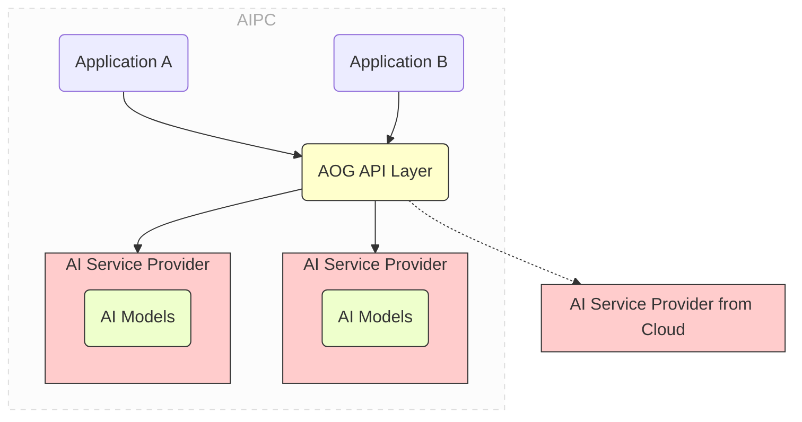

# AOG (AIPC Open Gateway) Preview

中文 | [English](README_en.md)

当前为 AOG 预览版 v0.7.0，更多功能和稳定性正在不断完善过程中。欢迎就发现的缺陷提交 Issues。

当前版本支持 chat、embed、text-to-image、generate、rerank、text-to-speech、speech-to-text、image-to-image、image-to-video、speech-to-text-ws 等服务，下层支持 ollama 和 openvino model server，并提供插件化扩展能力。更多服务如 OCR 等，以及其他 AI 引擎，敬请期待正在开发的后续版本。

**注意：** Linux 环境已支持 OpenVINO 引擎（当前仅支持 Ubuntu 24.04），可使用本地的 chat、embed、generate、rerank、text-to-image 等服务。其他 Linux 发行版本暂不支持 OpenVINO，需使用远程服务提供商。

详细中文文档请参见[此处](https://intel.github.io/aog/index.html)

## AOG 的功能

AOG（AIPC Open Gateway）的目标是解耦 AI PC 上的 AI 应用与它所依赖的 AI 服务。它旨在为开发者提供一个
极其简单易用的基础设施，以便他们在开发环境中安装本地 AI 服务，并发布他们的 AI 应用程序，无需打包自己
的 AI 堆栈和模型。



通过 AOG 提供统一的平台级的 AI 服务，AI 应用不再需要随自己的程序一起打包和发布 AI 引擎及模型。同时
，AI PC 上的多个 AI 应用使用统一的 AOG 提供的 AI 服务，因而无需冗余地部署和启动自己的 AI 栈。这显著
减少了应用大小，消除了每个应用重复下载相同 AI 栈和模型的情况，并在执行过程中避免了内存消耗的竞争。

AOG 提供以下基本功能：

- 一站式 AI 服务安装

  - 在开发过程中，开发者可以通过简单的命令如 `aog install chat` 或
    `aog pull-model deepseek-r1:1.5b for chat` ， 在他们的开发环境中本地安装 AI 服务。AOG 会自动下载
    并安 装最合适和优化的 AI 堆栈（例如 `ollama` 或 `openvino` ）和模型

  - 在部署过程中，开发者可以无需打包依赖的 AI 栈和模型即可发布他们的 AI 应用程序。AOG 将在需要时自动
    为部署的 PC 拉取所需的 AI 栈和模型。

- 解耦应用程序和 AI 服务提供商，通过共享服务和标准 API

  - AOG API 层提供了标准化 API，用于典型 AI 服务如聊天、嵌入等。开发者专注于其应用程序的业务逻辑，无
    需过 多关注底层 AI 服务栈。

  - AI 服务按平台提供，由同一系统上的多个应用程序共享。这避免了每个应用程序重复下载相同的 AI 服务栈
    和模 型，减少了内存消耗的竞争。

- 自动 API 转换，适配流行的 API 风格

  - 此外，AOG API 层还提供在流行的 API 风格（例如 OpenAI API）与 AOG 提供的 AI 服务之间的自动 API 转
    换。 这样一来，开发者可以轻松地将现有的基于云 AI 的应用程序迁移到基于 AOG 的 AIPC 应用程序。

- 本地与云 AI 服务提供商之间的混合调度

  - AOG 允许开发者在本地开发环境中安装 AI 服务。这些服务可以通过 AOG API 层进行访问。


## Control Panel

AOG 提供了一个控制面板，您可以通过浏览器访问它。Control Panel 提供了图形化界面来管理AOG的服务、模型和配置。

### 前置要求

在构建Control Panel前端页面之前，请确保您的系统已安装：
- [Node.js](https://nodejs.org/) (推荐版本 16.x 或更高)
- [Yarn](https://yarnpkg.com/) 包管理器

可以通过以下命令检查是否已安装：
```sh
node --version
yarn --version
```

### 构建前端页面

#### 方法一：使用自动化脚本（推荐）

**Linux/macOS 用户：**
```sh
# 运行自动化构建脚本
./build-frontend.sh
```

**Windows 用户：**
```cmd
# 运行自动化构建脚本
build-frontend.bat
```

该脚本会自动完成以下操作：
- 检查必要的依赖（yarn）
- 安装前端依赖
- 构建前端页面
- 清理现有的dist目录
- 将构建产物部署到console目录

#### 方法二：手动构建
如果需要手动构建，可以运行以下命令：

```sh
cd frontend/control_panel

yarn install

yarn build

# 手动移动构建产物到console目录
mv dist ../console/
```

### 启动 Control Panel

确保前端页面已构建完成后，在命令行中输入以下命令来启动 AOG：

```sh
# 前台启动AOG（推荐用于开发调试）
aog server start -v

# 或者后台启动AOG
aog server start -d
```

启动成功后，打开浏览器访问 http://127.0.0.1:16688/dashboard 即可进入Control Panel界面。

### 使用 Control Panel
在 Dashboard 界面，展示着您现有的服务 service 和模型 models 信息，您可以点击"+" 来添加新的服务和模型，点击 Hybrid Scheduling 中的选项来切换调度策略。

在 About AOG 界面，您可以查看现有的服务，及其支持下载的本地模型列表和支持认证的远程模型列表。

在安装完多个模型后，您可以进入一个模型详情页，勾选右上角的 "Set ad default model" 把模型设置为默认模型，在调用模型服务时，若您没有在请求体中指定模型，此次服务会使用默认模型。取消勾选即可取消设置默认模型。每个服务的 local/remote 均可设置一个默认模型。

## 构建 AOG

AOG 包含前端 Control Panel 和后端命令行工具两个部分。为了确保完整的功能，需要按照以下顺序进行构建：

### 第一步：构建前端 Control Panel

在构建 AOG 命令行工具之前，**必须先构建前端 Control Panel**，因为 AOG 会将前端资源嵌入到可执行文件中。

请参考上面的 [Control Panel 构建说明](#control-panel) 完成前端构建。

### 第二步：构建 AOG 命令行工具

#### 前置要求

作为开发者，为了构建 AOG，您需要在您的系统上安装：

- [Go](https://go.dev/) (推荐版本 1.19 或更高)
- 如果是 Windows 环境：
  - [MSYS2](https://www.msys2.org) (用于 Make 等命令)
  - [MinGW-W64](https://github.com/niXman/mingw-builds-binaries/releases) (用于 CGO 支持)
- 如果是 Linux 环境：
  - build-essential 包 (Ubuntu/Debian: `sudo apt-get install build-essential`)
  - 或 Development Tools 组 (CentOS/RHEL: `sudo yum groupinstall "Development Tools"`)
  - SQLite 开发库 (Ubuntu/Debian: `sudo apt-get install libsqlite3-dev`; CentOS/RHEL: `sudo yum install sqlite-devel`)

#### 构建步骤

1. **克隆或下载项目**
   ```sh
   git clone <repository-url>
   cd aog_private
   ```

2. **设置 Go 环境**
   ```sh
   # 设置 GOPROXY (可选，用于加速依赖下载)
   go env -w GOPROXY=https://goproxy.cn,direct
   ```

3. **确认前端已构建**
   ```sh
   # 检查 console/dist 目录是否存在且包含 index.html
   ls console/dist/index.html
   ```

4. **构建 AOG 可执行文件**

   **Linux:**
   ```sh
   # 确保已安装构建依赖
   # Ubuntu/Debian:
   sudo apt-get update
   sudo apt-get install build-essential libsqlite3-dev
   
   # CentOS/RHEL:
   # sudo yum groupinstall "Development Tools"
   # sudo yum install sqlite-devel
   
   # 构建AOG
   SQLITE_VEC_DIR="$(pwd)/internal/datastore/sqlite/sqlite-vec"
   CGO_ENABLED=1 CGO_CFLAGS="-I$SQLITE_VEC_DIR" go build -o aog -ldflags="-s -w" cmd/cli/main.go
   ```

   **macOS:**
   ```sh
   SQLITE_VEC_DIR="$(pwd)/internal/datastore/sqlite/sqlite-vec"
   CGO_ENABLED=1 CGO_CFLAGS="-I$SQLITE_VEC_DIR" go build -o aog -ldflags="-s -w" cmd/cli/main.go
   ```

   **Windows:**
   ```cmd
   set SQLITE_VEC_DIR=%cd%\internal\datastore\sqlite\sqlite-vec
   set CGO_ENABLED=1 && set CGO_CFLAGS=-I%SQLITE_VEC_DIR% && go build -o aog.exe -ldflags="-s -w"  cmd/cli/main.go
   ```

5. **验证构建结果**
   ```sh
   # Linux/macOS
   ./aog version

   # Windows
   aog.exe version
   ```

#### 注意事项

- **前端构建是必需的**：如果没有先构建前端，AOG 的 Control Panel 功能将无法正常工作
- **CGO 依赖**：AOG 需要启用 CGO，确保您的环境支持 C 编译器
- **路径配置**：建议将生成的可执行文件添加到系统 PATH 环境变量中，以便全局使用

### 完整构建脚本

为了简化构建过程，您也可以创建一个完整的构建脚本：

**Linux/macOS (build-all.sh):**
```sh
#!/bin/bash
set -e

echo "Building AOG - Complete Build Process"

# Step 1: Build frontend
echo "Step 1: Building frontend Control Panel..."
./build-frontend.sh

# Step 2: Build AOG
echo "Step 2: Building AOG command line tool..."
SQLITE_VEC_DIR="$(pwd)/internal/datastore/sqlite/sqlite-vec"
CGO_ENABLED=1 CGO_CFLAGS="-I$SQLITE_VEC_DIR" go build -o aog -ldflags="-s -w" cmd/cli/main.go

echo "Build completed successfully!"
echo "You can now run: ./aog server start"
```

**Linux 构建说明:**

Linux 平台构建 AOG 的步骤与 macOS 类似，但需要注意以下事项：

```sh
#!/bin/bash
set -e

echo "Building AOG on Linux - Complete Build Process"

# 确保依赖已安装
echo "Please ensure you have installed:"
echo "- build-essential (Ubuntu/Debian) or Development Tools (CentOS/RHEL)"
echo "- libsqlite3-dev (Ubuntu/Debian) or sqlite-devel (CentOS/RHEL)"

# Step 1: Build frontend
echo "Step 1: Building frontend Control Panel..."
./build-frontend.sh

# Step 2: Build AOG for Linux
echo "Step 2: Building AOG command line tool for Linux..."

# 计算 SQLITE_VEC_DIR 的绝对路径
SQLITE_VEC_DIR="$(pwd)/internal/datastore/sqlite/sqlite-vec"

# 检查目录是否存在
if [ ! -d "$SQLITE_VEC_DIR" ]; then
    echo "Error: SQLite vector directory not found at $SQLITE_VEC_DIR"
    exit 1
fi

# 构建命令
CGO_ENABLED=1 CGO_CFLAGS="-I$SQLITE_VEC_DIR" go build -o aog -ldflags="-s -w" cmd/cli/main.go

echo "Linux build completed successfully!"
echo "Note: OpenVINO features are supported on Ubuntu 24.04. Other Linux distributions need remote providers."
echo "You can now run: ./aog server start"
```

**Windows (build-all.bat):**
```bat
@echo off
echo Building AOG - Complete Build Process

echo Step 1: Building frontend Control Panel...
call build-frontend.bat

echo Step 2: Building AOG command line tool...
set SQLITE_VEC_DIR=%cd%\\internal\\datastore\\sqlite\\sqlite-vec
set CGO_ENABLED=1 && set CGO_CFLAGS=-I%SQLITE_VEC_DIR% && go build -o aog.exe -ldflags="-s -w" cmd/cli/main.go

echo Build completed successfully!
echo You can now run: aog.exe server start
pause
```

## 使用 AOG 命令行工具

构建完成后，您可以通过输入 `aog -h` 来查看命令行工具的帮助信息。

### 启动和停止 AOG 服务

```sh
# 前台启动AOG
aog server start

# 后台启动AOG
aog server start -d

# Debug模式启动
aog server start -v

# 停止AOG
aog server stop
```

AOG 有两个关键概念：**服务(Service)** 和 **服务提供商(Service Provider)**：

- 服务是一组 AI 功能，例如聊天 (chat)、嵌入(embed) 等，提供 RESTful 接口供应用程序调用使用。
- 服务提供商是实现并提供服务的具体实体。服务提供商可以是本地或远程的。

一个服务可以有多个服务提供商。例如，聊天服务可以同时有本地聊天服务提供商和远程聊天服务提供商。 其中
本地服务提供商由 ollama 提供，远程服务提供商由远程的 DeepSeek 或者通义千问提供。当应用程序使用 AOG
的 RESTful API 调用聊天服务的时候，AOG 会根据一定的规则， 自动选择合适的服务提供商，来完成该服务的真
正调用。

作为开发者，可以通过如下命令来快速安装、导入和配置相应的 AOG 服务和服务提供商

```sh
# 将 AI 服务安装到本地
# AOG 将安装必要的 AI 堆栈（如 ollama/openvino）和 AOG 推荐的模型
aog install chat
aog install embed
aog install text-to-image  # 注意：Linux平台不支持本地text-to-image服务

# 除了默认的模型之外，您可以在服务中安装更多的模型
aog pull <model_name> --for <service_name> --provider <provider_name>

# 获取服务信息，可查看指定服务，未指定则输出全部服务信息
aog get services <service_name>


# 修改服务配置
# hybrid_policy 指定具体服务的调度策略，可选值有 always_local, always_remote, default
aog edit service <service_name> --hybrid_policy always_remote


# 获取服务提供商信息，可设置可选参来获取指定服务提供商信息
aog get service_providers --service <service_name> --provider <provider_name> --remote <local/remote>

# 获取模型信息，可设置可选参获取指定模型信息
aog get models --provider <provider_name>

# 安装服务提供商， 安装过程中会自动拉取模型
aog install service_provider -f xx/xxx.json
# 文件名不作要求，内容需为json格式，示例：
{
    "provider_name": "local_ollama_chat",
    "service_name": "chat",
    "service_source": "local",
    "desc": "Local ollama chat/completion",
    "api_flavor": "ollama",
    "method": "POST",
    "url": "http://localhost:11434/api/chat",
    "auth_type": "none",
    "auth_key": "",
    "models": [
        "qwen2.5:0.5b",
        "qwen2:0.5b"
    ]
}

# 修改服务提供商配置，这里仅可修改服务商配置信息，模型变更需通过拉取模型和删除模型来进行
aog edit service_provider <provider_name> -f xxx/xxx.json
# 示例：
{
    "provider_name": "local_ollama_chat",
    "service_name": "chat",
    "service_source": "local",
    "desc": "Local ollama chat/completion",
    "api_flavor": "ollama",
    "method": "POST",
    "url": "http://localhost:11434/api/chat",
    "auth_type": "none",
    "auth_key": ""
}

# 删除服务提供商
aog delete service_provider <provider_name>

# 删除模型 必选参数：--provider
aog delete model <model_name>  --provider <provider_name>
```

## 调用 AOG API

AOG API 是一个 Restful API。您可以通过与调用云 AI 服务（如 OpenAI）类似的方式调用该 API。详细的 API
规范请参见 [AOG API 规范](https://intel.github.io/aog/index.html).

值得注意的是，当前 AOG 预览提供了基本的 chat 等服务，下一版本将会提供视频、音频相关的更多服务。
当前版本的文生图服务基于 OpenVINO 实现，通过 modelscope 拉取 openvino 转换过的 IR 格式的文生图模型提供服务。

**Linux 平台注意事项：**
- **Ubuntu 24.04**：完全支持本地 OpenVINO 服务（chat、embed、generate、rerank、text-to-image 等）
- **其他 Linux 发行版**：仅支持本地 Ollama 服务（chat、embed），OpenVINO 相关服务需使用远程服务提供商 

例如，您可以使用 `curl` 在 Windows 上测试聊天服务。

```sh
curl -X POST http://localhost:16688/aog/v0.2/services/chat  -X POST -H
"Content-Type: application/json" -d
"{\"model\":\"deepseek-r1:7b\",\"messages\":[{\"role\":\"user\",\"content\":\"why is
the sky blue?\"}],\"stream\":false}"
```

此外，如果您已经使用 OpenAI API 或 ollama API 等的应用程序，您无需重写调用 AOG 的方式以符合其规范。

因为 AOG 能够自动转换这些流行风格的 API，因此您只需更改端点 URL，就可以轻松迁移应用程序。

例如，如果您使用的是 OpenAI 的聊天完成服务，您只需将端点 URL 从
`https://api.openai.com/v1/chat/completions` 替换为
`http://localhost:16688/aog/v0.2/api_flavors/openai/v1/chat/completions`。

NOTE 请注意，调用 AOG 的新 URL 位于 `api_flavors/openai` ，其余 URL 与原始 OpenAI API 相同，即
`/v1/chat/completions` 。

如果您使用 ollama API，可以将端点 URL 从 `https://localhost:11434/api/chat` 替换为
`http://localhost:16688/aog/v0.2/api_flavors/ollama/api/chat` 。同样，它位于 `api_flavors/ollama` ，
其余 URL 与原始 ollama API 相同，即 `/api/chat`。

## 发布您的基于 AOG 的 AI 应用

要将您的 AI 应用程序发布，您只需将应用程序与一个微小的 AOG 组件打包，即所谓的 `AOG Checker` ，在
Windows 上是 `AOGChecker.dll` 。您不需要发布 AI 堆栈或模型。

以 C/C++/C#应用程序为例，以下是部署基于 AOG 的 AI 应用的步骤。

1. 准备与您的应用程序一起的 `.aog` 文件。 `.aog` 文件是一个文本清单文件，用于指定应用程序所需的 AI
   服务和模型。例如， `.aog` 文件可能看起来像这样：

```json
{
  "version": "v0.7",
  "service": {
    "chat": {
      "models": ["qwen2.5:0.5b", "qwen2.5:7b"]
    },
    "text-to-image": {
      "models": ["OpenVINO/stable-diffusion-v1-5-fp16-ov"]
    }
  }
}
```

2. 在您的 `main()` 函数中包含 `AOGChecker.h` 并调用 `AOGInit()` 。 `AOGInit()` 将：

   - 检查目标 PC 上是否已安装 AOG。如果没有，将自动下载并安装 AOG。
   - 检查所需的 AI 服务和模型（如在 `.aog` 文件中体现）是否已安装。如果没有，将自动下载并安装它们。

3. 将应用程序与 `aog.dll` 链接。

4. 将应用程序与 `.aog` 文件以及与您的应用程序 `.exe` 文件在同一目录下的 `AOGChecker.dll` 文件一起发
   布。

## 插件开发

AOG 支持通过插件扩展其功能，可以集成新的本地 AI 引擎或远程 AI 服务。

### 插件目录

AOG 会根据不同操作系统在以下位置搜索插件：

| 操作系统 | 插件目录路径 |
|---------|-------------|
| **Linux** | `/var/lib/aog/plugins` |
| **macOS** | `~/Library/Application Support/AOG/plugins` |
| **Windows** | `%APPDATA%\AOG\plugins` (通常为 `C:\Users\<用户名>\AppData\Roaming\AOG\plugins`) |

**自定义插件目录：** 可以通过设置环境变量 `AOG_PLUGIN_DIR` 来自定义插件目录。

**开发模式：** 如果当前工作目录包含 `plugins/` 子目录，AOG 会优先使用该目录，方便开发测试。

### 文档
- [AOG 插件开发指南](docs/zh-cn/source/aog插件开发指南.rst)

### 示例插件
- `plugin-example/ollama-plugin/`: 本地 Ollama 引擎插件示例
- `plugin-example/deepseek-plugin/`: 远程 DeepSeek API 插件示例

### 插件 SDK
- [Plugin SDK 文档](plugin-sdk/)

## 发布历史

### v0.7.0 (当前版本)

**发布日期：** 2025-11-19

**新功能：**
- 支持以插件化的方式接入本地和远程 AI 引擎的（提供了Plugin开发SDK、本地以及云端插件Example）
- 基于 OpenVINO 的 Chat/Embed/Generate/Rerank 服务支持
- Linux 环境加入了 OpenVINO 支持 （暂只支持 ubuntu 24.04）
- 支持无Python环境版的 OpenVINO 接入（无 Python 环境版仅支持 chat、embed、generate、rerank、text-to-image 服务）

**改进：**
- 优化服务启停机制和 Engine 保活逻辑
- 修复已知安全漏洞和稳定性问题
- 更新并完善文档内容

---

### v0.6.0

**发布日期：** 2025-09-11

**新功能：**
- RAG服务能力
- Linux系统支持（暂仅支持ollama）
- Engine跟随 AOG 版本自动升级（ollama/ovms）

**改进：**
- 修复了一些文档及稳定性bug

---

### v0.5.0

**发布日期：** 2025-08-15

**新功能：**
- AOG MCP Server 
- 语音合成能力支持（本地基于OpenVINO、云端支持阿里百炼、腾讯、百度千帆）
- 图生图、图生视频支持（暂仅支持云端阿里百炼）
- Chat/Generate 多模态输入支持
- 版本升级数据迁移

**改进：**
- 本地模型请求加入队列机制（当前非embed模型请求加入队列）、已加载模型定时清理机制
- 修复了一些稳定性bug及文档

---

### v0.4.0

**发布日期：** 2025-07-03

**新功能：**
- 基于OpenVINO的语音识别和实时语音识别的接入
- AOG Control Panel 可视化界面操控

**改进：**
- Ollama引擎模型存储路径不再使用Ollama官方默认的目录
- 修复了一些体验性bug及文档错误


---

### v0.3.0

**发布日期：** 2025-05-14

**新功能：**
- OpenVINO模型引擎的接入
- 多模态模型的支持（本地及云端的文生图）
- Node SDK: 发布 Node.js 版 SDK（未来支持 .NET/Java/Swift等），提供比 AOG Checker 更强的扩展性和可用性
- AOG Checker 增强: 新增 .NET/C++/C/Python/Go/Node.js 多语言依赖包支持
- Demo Application: 新增基于 AOG Checker 的集成示例项目


---

### v0.2.1

**发布日期：** 2025-03-25

**新功能：**
- 完整的模型管理能力
- 开发者友好的CLI命令行工具
- AOG Checker的集成方式
- chat/embed模型能力云端服务支持（阿里百炼、腾讯混元、百度千帆）
- Ollama 模型引擎的接入
- 集成的示例Demo


